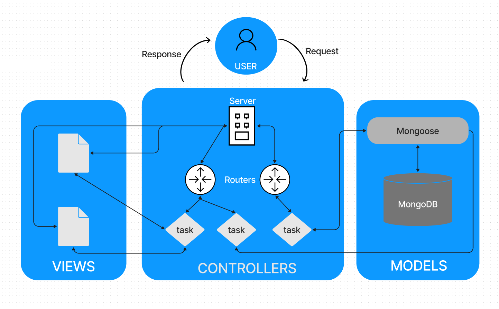

# Model View Controller

Its a architectural paradigm for programming.

Its a way of thinking and processing information to structure your application so it processes information in the right way.

A code structure that separates functionality into logical segments

Incorporates the idea of “separation of concerns” by abstracting code into components

## Benefits

Never repeat yourself. Code that will be used in multiple places will be stored in only one place.

Creates a solid structure for a web application. Everything has its place.

Very clean and organized

